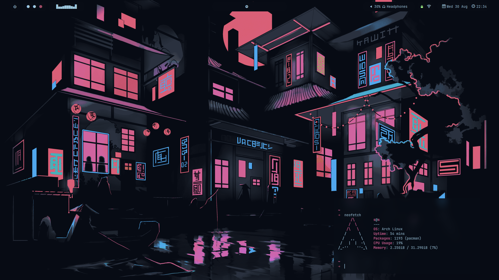

# Dotfiles

Here are my dotfiles for my [Arch Linux](https://archlinux.org/) system.

## Showcase

## Information

- **OS** - [Arch Linux](https://archlinux.org/) 
- **WM** - [i3wm](https://i3wm.org/)
- **Terminal** - [kitty](https://sw.kovidgoyal.net/kitty/)
- **Bar** - [polybar](https://polybar.github.io/)
- **Compositor** - [picom](https://github.com/yshui/picom) (*development version*)
- **Shell** - [zsh](https://www.zsh.org/) + [ohmyzsh](https://ohmyz.sh/)
- **Shell Prompt** - [Starship](https://starship.rs/)
- **Launcher** - [rofi](https://github.com/davatorium/rofi)
- **Notification Daemon** - [dunst](https://github.com/dunst-project/dunst)
- **Lock Screen** [BetterLockScreen](https://github.com/betterlockscreen/betterlockscreen)
- **Font** - [JetBrains Mono Nerd Font](https://archlinux.org/packages/extra/any/ttf-jetbrains-mono-nerd/)
- **Wallpaper** - [Neon Shallows Recoloured](https://images.wallpapersden.com/image/download/the-neon-shallows-building_bG1rbG6UmZqaraWkpJRnamtlrWZpaWU.jpg)

## More Info
- **GTK Theme** - [Juno Mirage](https://www.gnome-look.org/p/1280977)
- **Icons** - [Papirus Dark](https://github.com/PapirusDevelopmentTeam/papirus-icon-theme)
- **Colours** - [pywal](https://github.com/dylanaraps/pywal)
- **PDF Reader** - [zathura](https://pwmt.org/projects/zathura/) + [zathura-pywal](https://github.com/matthewlscarlson/zathura-pywal)
- **File Manager** - [Thunar](https://docs.xfce.org/xfce/thunar/start)
- **Display Manager** - [SDDM](https://github.com/sddm/sddm) + [Astronaut Theme](https://github.com/joe733/sddm-theme-astronaut)

## Note

### Polybar

To get the VPN Module working, [Polybar VPN Controller](https://github.com/shervinsahba/polybar-vpn-controller) was used 

The sound module is controlled by [Polybar Pulse Audio Control](https://github.com/marioortizmanero/polybar-pulseaudio-control)

The Spotify module requires [zscroll](https://github.com/noctuid/zscroll)

The audio visualiser bar is done through [cava](https://github.com/karlstav/cava)

### i3

[Playerctl](https://github.com/altdesktop/playerctl) is needed for media keys to work

### Icons + Themes 
[lxappearance](https://archlinux.org/packages/extra/x86_64/lxappearance/) used to apply Icon and GTK Themes

## To Do

- [ ] Configure Neovim
- [ ] Add to showcase