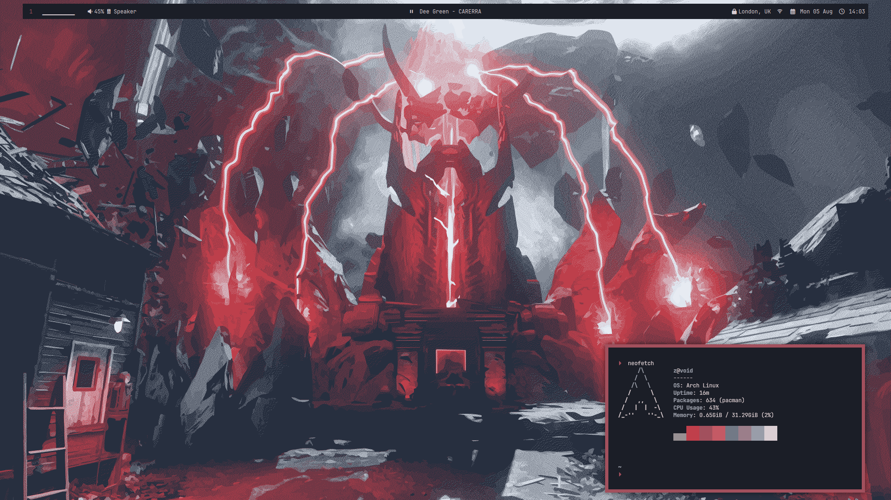

# dotfiles

</img>

## resources

- wm : [i3](https://i3wm.org/)

- bar : [polybar](https://github.com/polybar/polybar)
    - visualiser : [cava](https://github.com/karlstav/cava)
    - audio : [pavucontrol](https://www.freedesktop.org/software/pulseaudio/pavucontrol/)
    - vpn : [mullvad vpn controller](https://github.com/shervinsahba/polybar-vpn-controller)

- notifications : [dunst](https://github.com/dunst-project/dunst)

- terminal : [kitty](https://github.com/kovidgoyal/kitty)
    - shell : [zsh](https://www.zsh.org/) + [ohymyzsh](https://github.com/ohmyzsh/wiki)
    - prompt : [starship](https://starship.rs/)

- compositor : [picom (dev version)](https://github.com/yshui/picom)

- launcher / powermenu : [rofi](https://github.com/davatorium/rofi) 

- lockscreen : [betterlockscreen](https://github.com/betterlockscreen/betterlockscreen)

- audio : [pulseaudio](https://www.freedesktop.org/wiki/Software/PulseAudio/) + [pipewire](https://www.pipewire.org/) + [pulseaudiocontrol](https://aur.archlinux.org/packages/pulseaudio-control)

- music : [mpd](https://www.musicpd.org/) + [mpDris2](https://github.com/eonpatapon/mpDris2) + [ncmpcpp](https://github.com/ncmpcpp/ncmpcpp)

- font : [jetbrains mono nerd](https://www.jetbrains.com/lp/mono/)

- gtk theme : [nordic darker](https://github.com/EliverLara/Nordic) + [papirus dark icons](https://github.com/PapirusDevelopmentTeam/papirus-icon-theme)

- dm : [sddm](https://github.com/sddm/sddm/)
    - theme : [astronaut](https://github.com/Keyitdev/sddm-astronaut-theme)

- [wallpaper](https://ibb.co/Yf8S1SM)